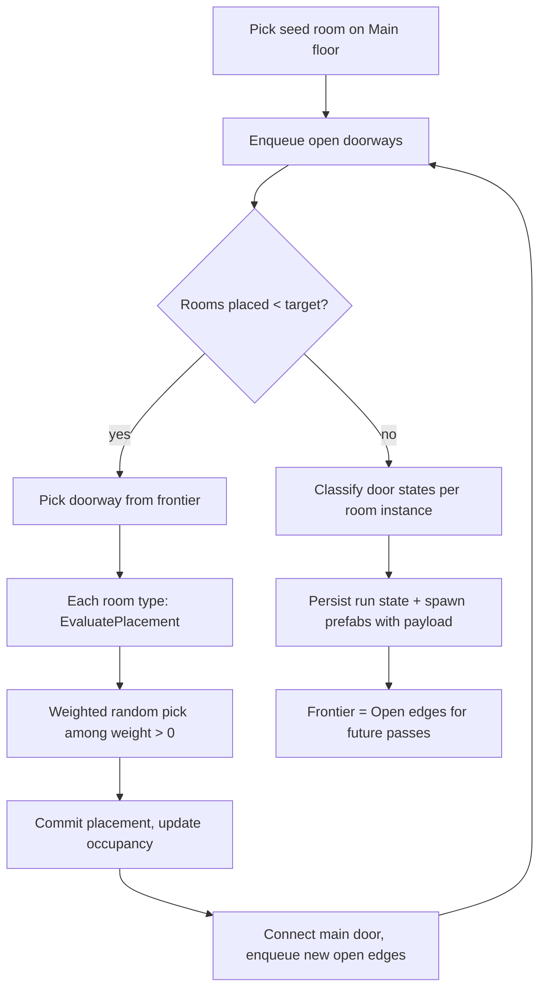
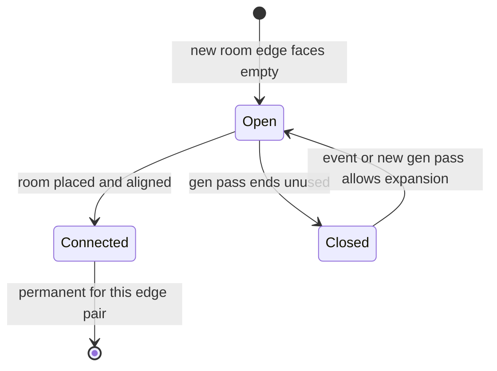

# Level generator plan — office building

Authoritative design for procedural office-building layout: three floors (basement, main, attic), grid-based polyomino rooms, doorway-driven expansion, and prefab-based authoring. Read this before implementing level generation, room templates, or building spawn systems.

Related: [GameDesign.md](GameDesign.md) (persistent run world, ECS, no round-end map wipes).

---

## Goals

- Generate an **office building** with **three floors**: basement, main, attic.
- Start on **main floor** with a **random seed room**, then expand for a **configurable room count**.
- Each step: pick an **open doorway** on the frontier → pick and place a room whose **main door aligns** with that doorway.
- Room shapes are **polyominoes** on a square grid; track **used coordinates per floor** to prevent overlap.
- Each grid cell can have **0–4 doors** on its edges; **unopened perimeter edges are walls**.
- **Room types control their own selection weight**; a shared base returns **0** on hard invalid placements (overlap, misaligned main door, door into wall).
- At generation end, **room prefabs receive door states** (`Connected` / `Closed` / `Open`). **`Open` edges remain valid** attachment points for later generation passes (events, additive wings).
- **No building bounds** in the generator; rooms own **camera anchor** and **spawn point** placeholders (existing systems are dev placeholders).

---

## High-level flow



---

## Coordinate and floor model

- Gameplay plane: **XZ** (Y is up). See `TopDownPlane` and model-forward **-Z** when authoring room facings.
- **Cell**: `int2` grid position on a floor.
- **FloorId**: `Basement`, `Main`, `Attic`.
- World position: `TopDownPlane.ToPosition(cell * CellSize, floorY)`.
- **Overlapping floors are allowed**: the same `(x, z)` may be occupied on different floors. Occupancy is **per floor only**, not a global 3D voxel grid.
- Vertical links (stairs, elevator, shaft) are room templates that agree on `(x, z)` across floors.

---

## Core data structures

### Room template (baked logical layer)

Authored from room prefabs (see [Room and prefab authoring](#room-and-prefab-authoring)). Baked into immutable blobs (same pattern as `SafeRandomSpawner` / `SpawnConfigBlob`).

| Field | Purpose |
|-------|---------|
| `TemplateId` | Stable string key |
| `AllowedFloors` | Which floors this type may appear on |
| `BaseWeight` | Default selection weight |
| `CellOffset[]` | Polyomino cells in local space |
| `DoorSocket[]` | Per cell-edge: local cell, side, is main door |
| `MainDoorCell` + `MainDoorSide` | Entrance used when expanding from frontier |
| `Evaluator` | `RoomTemplateBase` ScriptableObject for soft weights |
| Entity prefab reference | What to instantiate at runtime |

**Perimeter = wall**: any cell edge on the room boundary without a door socket is a wall.

### Occupancy (per floor)

```
Dictionary<FloorId, FloorGrid>
FloorGrid.Cells : int2 → OccupiedCell { RoomInstanceId, OpenSides }
```

### Frontier (expansion queue)

```
DoorwaySlot { Floor, Cell, Side, FromRoom, Depth? }
```

Open outward edges not yet connected or marked dead.

### Room instance (persistent run state)

```
RoomInstance {
  TemplateId, Floor, Origin, Rotation90,
  CellDoorState[] DoorStates   // per socket: Connected | Closed | Open
}
```

---

## Generation algorithm

### Config

| Knob | Purpose |
|------|---------|
| `TargetRoomsPerFloor` (or total) | Size control |
| `MaxPlacementAttempts` | Per doorway before marking dead |
| `DoorAlignBonus` / `WallBlockPenalty` | Soft weight multipliers (on evaluators) |
| `Seed` | Deterministic runs |
| `FloorMode` | Main-first spine, then basement/attic via vertical links |

### Phase 1 — Seed (main floor)

1. Filter templates allowed on `Main`.
2. Weighted pick by `EvaluatePlacement` (seed context: no target doorway; only hard rules + base weight).
3. Place at chosen origin; stamp cells; enqueue all outward door sockets.

### Phase 2 — Expand until budget exhausted

For each iteration:

1. **Pick doorway** from frontier (random or weighted).
2. **For each room type** on this floor, for each valid `(origin, rotation)` where main door mates with the doorway:
   - `weight = roomType.EvaluatePlacement(ctx, origin, rotation)`
   - Skip if `weight <= 0`.
3. **Weighted random** among all candidates.
4. **Commit**: write cells, connect main door (remove both sides from frontier), enqueue other open outward edges.
5. On repeated failure for a doorway, mark **dead** (becomes `Closed` at end of pass).

**Placement validity (hard zero in base class):**

- Any rotated cell overlaps occupied grid on this floor.
- Main door does not align with target doorway (opposite cells, opposite sides).
- Any door would face an occupied neighbor with no matching door (wall block).
- Template not allowed on this `FloorId`.

**Soft weights (subclass evaluators):**

- Bonus when an optional door would align with another open door.
- Penalty when a door would face a wall (usually already hard-zero).
- Tag affinity (corridor → break room), branch vs loop preferences, etc.

### Phase 3 — Multi-floor

Recommended v1:

1. Expand **main floor** first (including stair/shaft room types).
2. Run the same expand loop on **basement** and **attic** starting from doorways created by vertical-link rooms (shared `(x, z)`).

### Phase 4 — End of pass

For each room instance, classify every outward socket:

| State | Meaning |
|-------|---------|
| `Connected` | Mated with another room this pass |
| `Closed` | Unused frontier or faces void after budget — **prefab shows closed door / wall** |
| `Open` | Reserved for future expansion — **not closed visually**; stays on frontier for later passes |

Persist `RoomInstance` + `DoorStates` to run state. Spawn prefabs with `RoomInstancePayload`.

**Later generation passes** (events, new room budget): reload occupancy from instances; frontier = all `Open` edges; `Closed` may be promoted to `Open` by events or config.



---

## Room-driven probability

Orchestrator only collects candidates and weighted-picks. **Each room type owns scoring.**

```csharp
abstract class RoomTemplateBase : ScriptableObject
{
    float BaseWeight;
    float EvaluatePlacement(PlacementContext ctx, RoomTemplateBlob blob, int2 origin, Rotation90 rot);
}
```

Base helper returns **0** for overlap, main-door misalignment, door-into-wall, floor mask mismatch. Subclasses multiply `BaseWeight` for soft preferences.

Orchestrator sketch:

```csharp
foreach (var template in catalog.For(floor))
    foreach (var placement in template.AlignedPlacements(slot))
    {
        float w = template.Evaluator.EvaluatePlacement(ctx, blob, origin, rot);
        if (w > 0) candidates.Add((template, placement, w));
    }
var chosen = WeightedPick(candidates);
```

---

## Room and prefab authoring

**Hybrid model:** room **prefab is the designer workspace**; **baker extracts logical data** for the generator.

### Two layers

| Layer | Owner |
|-------|--------|
| Logical template (grid, doors, weight, evaluator) | Baked blob + catalog |
| Visual prefab (meshes, voxels, props, anchors) | Prefab hierarchy |

### Recommended prefab hierarchy

```
Office_2x2 (root, local origin, facing -Z)
├── RoomTemplateAuthoring
├── Floor / walls / voxels          (fixed art)
├── Doors/
│   └── DoorSocket_* per edge
├── FixedProps/                     (always spawned with room)
├── PropSlots/                      (weighted random props)
└── Anchors/
    ├── CameraAnchorSlot            (placeholder)
    └── SpawnPointSlot              (placeholder)
```

Local **X = grid X**, **Z = grid Z**, one cell = `CellSize` world units (e.g. 4 m).

### Authoring components

| Component | Role |
|-----------|------|
| `RoomTemplateAuthoring` | Id, floors, cell size, main door, evaluator SO, bake root |
| `RoomCellMarker` | One per polyomino cell; validator checks connected shape |
| `DoorSocketMarker` | Cell + side; `IsMainDoor`; open/closed visual prefab refs |
| `PropSlotAuthoring` | Position + `PropSpawnTable` + optional rules (`RequiresWall`) |
| `PropSpawnTable` | ScriptableObject: weighted prop prefab list |
| `CameraAnchorSlot` / `SpawnPointSlot` | Placeholder transforms for existing dev systems |

### Prop tiers

1. **Fixed** — children under `FixedProps`; always part of room entity prefab.
2. **Random** — `PropSlotAuthoring` + `PropSpawnTable`; rolled at spawn (seed: `hash(runSeed, roomInstanceId, slotIndex)`).
3. **Structural** — door open/closed variants on `DoorSocketMarker`; toggled from `DoorStates` at spawn, not rebaked.

### Room catalog

`RoomCatalog` ScriptableObject lists all room prefabs (manual list v1; folder scan later). Build `Dictionary<TemplateId, RoomTemplateBlob>` at bake or enter playmode.

### Designer workflow

1. Create prefab, snap art to grid (`CellSize`).
2. Place `RoomCellMarker` per cell; `DoorSocketMarker` per expansion edge (one main door).
3. Add fixed props and prop slots with tables.
4. Add anchor/spawn placeholders.
5. Assign `RoomTemplateAuthoring` + evaluator ScriptableObject.
6. Run editor validator; add to `RoomCatalog`.

### Runtime spawn pipeline

1. Generator produces `RoomInstance` (pose + `DoorStates`).
2. `RoomSpawnSystem` instantiates room entity prefab at world transform.
3. `RoomBootstrapSystem` applies door visuals per socket state; rolls prop slots; registers anchor/spawn placeholders.

```csharp
struct RoomInstancePayload : IComponentData
{
    FixedString64Bytes TemplateId;
    FloorId Floor;
    int2 Origin;
    byte Rotation90;
    // ref to per-socket door states
}
```

---

## Integration with project

| Concern | Approach |
|---------|----------|
| Top-down / -Z forward | Author rooms facing -Z; rotation math aligns with `TopDownPlane` |
| ECS | Generator runs at run start or on additive passes; spawn via entity prefabs + ECB (see `PrefabSpawnerSystem`, baking patterns) |
| Persistent world | Building layout is baseline run layer; omens/events add content — **no full regen between rounds** |
| Camera / spawn | Per-room placeholder slots; no generator-level bounds |
| Determinism | `Unity.Mathematics.Random` + run seed |

---

## Suggested implementation phases

| Phase | Deliverable |
|-------|-------------|
| **1** | Per-floor grid, polyomino rotation, `RoomTemplateBase` hard zeros, unit tests |
| **2** | Main-floor expansion, end-pass door classification, debug Gizmos |
| **3** | Basement + attic + vertical link templates |
| **4** | Prefab authoring components, baker, catalog, spawn + bootstrap |
| **5** | Re-entry frontier from `Open` edges; hook into run start / events |

---

## Proposed file layout (implementation)

```
Assets/LevelGen/
  RoomCatalog.asset
  RoomTemplates/          # prefabs
  Evaluators/             # RoomTemplateBase ScriptableObjects
  PropTables/
  Scripts/
    RoomTemplateAuthoring.cs
    DoorSocketMarker.cs
    PropSlotAuthoring.cs
    PropSpawnTable.cs
    RoomTemplateBase.cs
    RoomCatalog.cs
    OfficeBuildingGenerator.cs
    RoomSpawnSystem.cs
    RoomBootstrapSystem.cs
  Editor/
    RoomTemplateValidator.cs
    RoomGridSnapEditor.cs
```

---

## Edge cases (decided)

| Topic | Decision |
|-------|----------|
| Floor overlap | Allowed — occupancy per `FloorId` |
| Gen end doors | Prefabs get `Closed` vs `Connected`; `Open` kept for later loops |
| Bounds | Not in generator; anchors/spawns on room prefabs |
| Probability | Room evaluators return 0 on hard failure; orchestrator only weighted-picks |

---

## Anti-patterns

- Grid only in ScriptableObject, art in unrelated prefab → logic/visual drift.
- Generator spawns per-cell wall/door prefabs instead of room prefab + socket toggles.
- Props only in C# lists → designers cannot iterate.
- Rebaking rooms when doors close → door state is **runtime payload**, not bake data.
