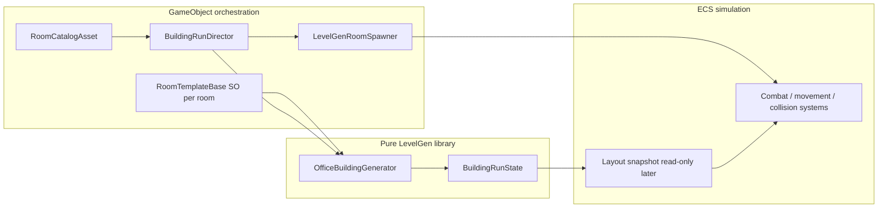
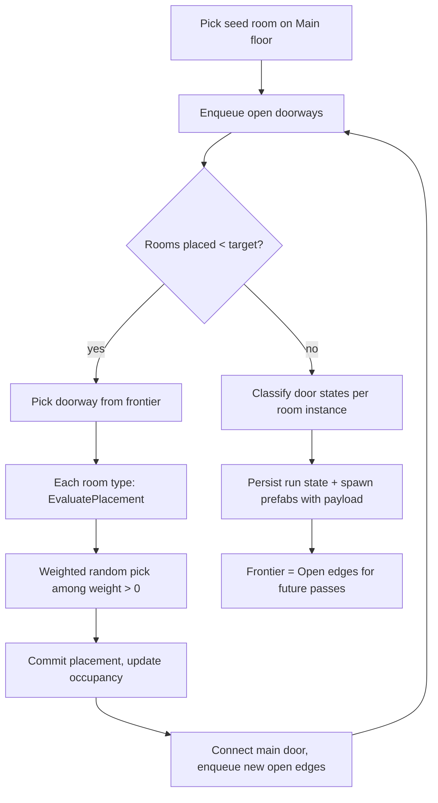
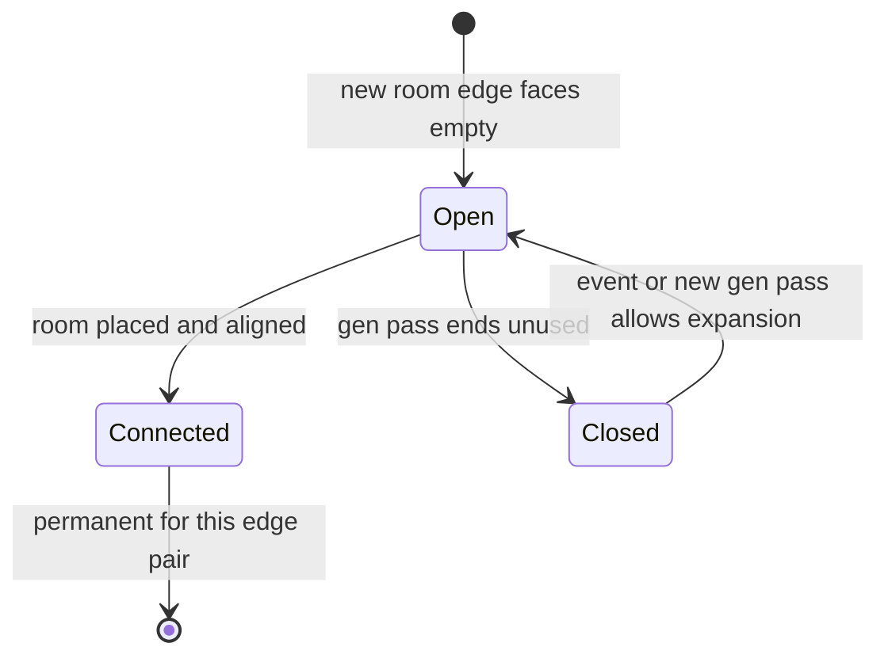

# Level generator plan — office building

Authoritative design for procedural office-building layout: **grid-based polyomino rooms**, doorway-driven expansion, and prefab-based authoring. Read this before implementing level generation, room templates, or building spawn systems.

**Beta scope:** one playable floor (**Main**). **Multi-floor** (basement, main, attic, vertical links) is a **post-beta feature** — deferred to much later development, but types and data layout should stay ready for it.

Related: [GameDesign.md](GameDesign.md) (persistent run world, ECS, no round-end map wipes).

---

## Architecture — orchestration vs simulation

**Intention:** Room **generation passes** and **bulk spawn** are owned by **GameObjects** (`BuildingRunDirector`). **Placement scoring and weights** live on **per-room `RoomTemplateBase` evaluators** (subclass `DefaultRoomEvaluator` for special cases; assign on prefab or catalog **Evaluator Override**). **Gameplay simulation** stays in **ECS / Burst**.

| Concern | Owner | Examples |
|---------|--------|----------|
| **When** to generate / expand | `BuildingRunDirector` (MonoBehaviour) | Run start, event wing, round budget |
| **Which room fits a doorway + weight** | `RoomTemplateBase` on each room (ScriptableObject) | Subclass `DefaultRoomEvaluator`; catalog **Evaluator Override** |
| **What rooms exist in the project** | `RoomCatalogAsset` | Prefab list + builtin fallback |
| **How** to place on the grid | `THPerfection.LevelGen` pure library | `OfficeBuildingGenerator`, hard rules, frontier |
| **Spawn** room prefabs / anchors | `LevelGenRoomSpawner` under the director | Instantiate art, door states |
| **Simulate** the live map | ECS systems (Burst-friendly) | Attacks, hurtboxes, enemies, walls, pause |


```mermaid
flowchart LR
    subgraph go [GameObject orchestration]
        Director[BuildingRunDirector]
        Catalog[RoomCatalogAsset]
        PerRoom[RoomTemplateBase SO per room]
        Spawner[LevelGenRoomSpawner]
    end
    subgraph lib [Pure LevelGen library]
        Gen[OfficeBuildingGenerator]
        State[BuildingRunState]
    end
    subgraph ecs [ECS simulation]
        Sim[Combat / movement / collision systems]
        Layout[Layout snapshot read-only later]
    end
    Catalog --> Director
    PerRoom --> Gen
    Director --> Gen
    Gen --> State
    Director --> Spawner
    Spawner --> Sim
    State --> Layout
    Layout --> Sim
```

**Rules for contributors:**

- Do **not** put placement scoring or weight multipliers in a separate run-level policy layer — use **evaluator subclasses**.
- Do **not** put omen/event logic inside `OfficeBuildingGenerator` or ECS spawn systems.
- Do **not** make an ECS system pick room types or call `ExpandMainFloor` — **`BuildingRunDirector`** commits layout and triggers spawn.
- **Many instances spawned at once** → GameObject orchestrator; ECS simulates after spawn.
- **`LevelGenDebugView`** is dev-only; production scenes use **`BuildingRunDirector`**.

---

## Goals

- Generate an **office building** layout on a square grid with **doorway-driven expansion**.
- **Beta:** generate and play on the **main floor only** (`TargetRoomCount` on Main).
- **Later (post-beta):** add **basement** and **attic** floors connected by vertical-link room templates; same generator loop, per-floor occupancy.
- Start on **main floor** with a **random seed room**, then expand for a **configurable room count**.
- Each step: pick an **open doorway** on the frontier → pick and place a room whose **main door aligns** with that doorway.
- Room shapes are **polyominoes** on a square grid; track **used coordinates per floor** to prevent overlap.
- Each grid cell can have **0–4 doors** on its edges; **unopened perimeter edges are walls**.
- **Room types control their own selection weight**; a shared base returns **0** on hard invalid placements (overlap, misaligned main door, door into wall).
- At generation end, **room prefabs receive door states** (`Connected` / `Closed` / `Open`). **`Open` edges remain valid** attachment points for later generation passes (events, additive wings).
- **No building bounds** in the generator; rooms own **camera anchor** and **spawn point** placeholders (existing systems are dev placeholders).

---

## Beta vs later features

| Area | Beta | Post-beta (design now, implement later) |
|------|------|----------------------------------------|
| Playable floors | **Main only** | Basement + attic expansion passes |
| Generator entry | `GenerateMainFloor` | Multi-floor orchestrator after vertical links exist |
| Room catalog | Main-floor templates | Floor-masked templates + stair/shaft/elevator links |
| Occupancy API | `BuildingOccupancy` per `FloorId` (Main used) | Same API; all floors populated |
| Vertical links | Not required for beta gameplay | Shared `(x, z)` across floors; link room opens basement/attic frontiers |
| Prefab authoring | `AllowedFloors` on templates | Same field — tag basement-only / attic-only rooms early |

**Design rule:** keep `FloorId`, `FloorMask`, per-floor grids, and `AllowedFloors` in templates even while beta only generates Main. Do not fold everything into a single-floor-only model that would require a breaking refactor later.

---

## High-level flow


```mermaid
flowchart TD
    A[Pick seed room on Main floor] --> B[Enqueue open doorways]
    B --> C{Rooms placed < target?}
    C -->|yes| D[Pick doorway from frontier]
    D --> E[Each room type: EvaluatePlacement]
    E --> F[Weighted random pick among weight > 0]
    F --> G[Commit placement, update occupancy]
    G --> H[Connect main door, enqueue new open edges]
    H --> B
    C -->|no| I[Classify door states per room instance]
    I --> J[Persist run state + spawn prefabs with payload]
    J --> K[Frontier = Open edges for future passes]
```

---

## Coordinate and floor model

- Gameplay plane: **XZ** (Y is up). See `TopDownPlane` and model-forward **-Z** when authoring room facings.
- **Cell**: `int2` grid position on a floor.
- **FloorId**: `Basement`, `Main`, `Attic` — **all three exist in code/types from the start**; beta generation and gameplay use **`Main` only**.
- World position: `TopDownPlane.ToPosition(cell * CellSize, floorY)`.
- **Overlapping floors are allowed** (future): the same `(x, z)` may be occupied on different floors. Occupancy is **per floor only**, not a global 3D voxel grid. Beta does not populate other floors yet.
- **Later:** vertical links (stairs, elevator, shaft) are room templates that agree on `(x, z)` across floors and seed basement/attic frontiers.

---

## Core data structures

### Room template (baked logical layer)

Authored from room prefabs (see [Room and prefab authoring](#room-and-prefab-authoring)). Baked into immutable blobs (same pattern as `SafeRandomSpawner` / `SpawnConfigBlob`).

| Field | Purpose |
|-------|---------|
| `TemplateId` | Stable string key |
| `AllowedFloors` | Which floors this type may appear on |
| `BaseWeight` | Default selection weight |
| `CellOffset[]` | Polyomino cells in local space |
| `DoorSocket[]` | Per cell-edge: local cell, side, is main door |
| `MainDoorCell` + `MainDoorSide` | Entrance used when expanding from frontier |
| `Evaluator` | `RoomTemplateBase` ScriptableObject for soft weights |
| Entity prefab reference | What to instantiate at runtime |

**Perimeter = wall**: any cell edge on the room boundary without a door socket is a wall.

### Occupancy (per floor)

```
Dictionary<FloorId, FloorGrid>
FloorGrid.Cells : int2 → OccupiedCell { RoomInstanceId, OpenSides }
```

### Frontier (expansion queue)

```
DoorwaySlot { Floor, Cell, Side, FromRoom, Depth? }
```

Open outward edges not yet connected or marked dead.

### Room instance (persistent run state)

```
RoomInstance {
  TemplateId, Floor, Origin, Rotation90,
  CellDoorState[] DoorStates   // per socket: Connected | Closed | Open
}
```

---

## Generation algorithm

### Config

| Knob | Purpose |
|------|---------|
| `TargetRoomsPerFloor` (or total) | Size control |
| `MaxPlacementAttempts` | Per doorway before marking dead |
| `DoorAlignBonus` / `WallBlockPenalty` | Soft weight multipliers (on evaluators) |
| `Seed` | Deterministic runs |
| `FloorMode` | **Beta:** Main only. **Later:** Main-first spine, then basement/attic via vertical links |

### Phase 1 — Seed (main floor) — **beta + later**

1. Filter templates allowed on `Main`.
2. Weighted pick by `EvaluatePlacement` (seed context: no target doorway; only hard rules + base weight).
3. Place at chosen origin; stamp cells; enqueue all outward door sockets.

### Phase 2 — Expand until budget exhausted — **beta + later**

For each iteration:

1. **Pick doorway** from frontier (random or weighted).
2. **For each room type** on this floor, for each valid `(origin, rotation)` where main door mates with the doorway:
   - `weight = roomType.EvaluatePlacement(ctx, origin, rotation)`
   - Skip if `weight <= 0`.
3. **Weighted random** among all candidates.
4. **Commit**: write cells, connect main door (remove both sides from frontier), enqueue other open outward edges.
5. On repeated failure for a doorway, mark **dead** (becomes `Closed` at end of pass).

**Placement validity (hard zero in base class):**

- Any rotated cell overlaps occupied grid on this floor.
- Main door does not align with target doorway (opposite cells, opposite sides).
- Any door would face an occupied neighbor with no matching door (wall block).
- Template not allowed on this `FloorId`.

**Soft weights (subclass evaluators):**

- Bonus when an optional door would align with another open door.
- Penalty when a door would face a wall (usually already hard-zero).
- Tag affinity (corridor → break room), branch vs loop preferences, etc.

### Phase 3 — Multi-floor — **post-beta (deferred)**

Not required for beta. Likely returned to **much later** in development after core main-floor loop, prefabs, and run integration are stable.

When implemented:

1. Expand **main floor** first (including stair/shaft room types).
2. Run the same expand loop on **basement** and **attic** starting from doorways created by vertical-link rooms (shared `(x, z)`).

Until then: keep `BuildingOccupancy`, `FloorId`, and `AllowedFloors` in place; do not remove basement/attic from enums or tests that verify per-floor isolation.

### Phase 4 — End of pass — **beta + later**

For each room instance, classify every outward socket:

| State | Meaning |
|-------|---------|
| `Connected` | Mated with another room this pass |
| `Closed` | Unused frontier or faces void after budget — **prefab shows closed door / wall** |
| `Open` | Reserved for future expansion — **closed visually during gameplay**; shown open again during the next spawn/expansion pass (`BuildingRunDirector.EnterSpawningDoorPhase`) |

Persist `RoomInstance` + `DoorStates` to run state. Spawn prefabs with `RoomInstancePayload`.

**Later generation passes** (events, new room budget): reload occupancy from instances; frontier = all `Open` edges; `Closed` may be promoted to `Open` by events or config.


```mermaid
stateDiagram-v2
    [*] --> Open: new room edge faces empty
    Open --> Connected: room placed and aligned
    Open --> Closed: gen pass ends unused
    Closed --> Open: event or new gen pass allows expansion
    Connected --> [*]: permanent for this edge pair
```

---

## Room-driven probability

**All placement scoring and weights** live on **`RoomTemplateBase`** ScriptableObjects — one evaluator per room type (or shared across types). Subclass **`DefaultRoomEvaluator`** and override `ApplySoftWeights` for special cases (corridor bias, event-only rooms, etc.).

**Assigning evaluators:**

| Priority | Source |
|----------|--------|
| 1 | `RoomCatalogAsset` entry → **Evaluator Override** |
| 2 | Room prefab → `RoomTemplateAuthoring.Evaluator` |
| 3 | `HardRulesOnlyEvaluator` (overlap / door alignment only) |

**`BuildingRunDirector`** builds the catalog from `RoomCatalogAsset` and calls the pure generator. It does **not** apply a separate weight-multiplier policy layer.

Orchestrator only collects candidates and weighted-picks. **Each room type owns its score via its evaluator.**

```csharp
abstract class RoomTemplateBase : ScriptableObject
{
    float BaseWeight;
    float EvaluatePlacement(PlacementContext ctx, RoomTemplateBlob blob, int2 origin, Rotation90 rot);
}
```

Base helper returns **0** for overlap, main-door misalignment, door-into-wall, floor mask mismatch. Subclasses multiply `BaseWeight` for soft preferences.

Orchestrator sketch:

```csharp
foreach (var template in catalog.For(floor))
    foreach (var placement in template.AlignedPlacements(slot))
    {
        float w = template.Evaluator.EvaluatePlacement(ctx, blob, origin, rot);
        if (w > 0) candidates.Add((template, placement, w));
    }
var chosen = WeightedPick(candidates);
```

---

## Room and prefab authoring

**Hybrid model:** room **prefab is the designer workspace**; **baker extracts logical data** for the generator.

### Two layers

| Layer | Owner |
|-------|--------|
| Logical template (grid, doors, weight, evaluator) | Baked blob + catalog |
| Visual prefab (meshes, voxels, props, anchors) | Prefab hierarchy |

### Recommended prefab hierarchy

```
Office_2x2 (root, local origin, facing -Z)
├── RoomTemplateAuthoring
├── Floor / walls / voxels          (fixed art)
├── Doors/
│   └── DoorSocket_* per edge
├── FixedProps/                     (always spawned with room)
├── PropSlots/                      (weighted random props)
└── Anchors/
    ├── CameraAnchorSlot            (placeholder)
    └── SpawnPointSlot              (placeholder)
```

Local **X = grid X**, **Z = grid Z**, one cell = `CellSize` world units (beta default **150**; configurable on `BuildingGenConfig`).

### Authoring components

| Component | Role |
|-----------|------|
| `RoomTemplateAuthoring` | Id, floors, cell size, main door, evaluator SO, bake root |
| `RoomCellMarker` | One per polyomino cell; validator checks connected shape |
| `DoorSocketMarker` | Cell + side; `IsMainDoor`; open/closed visual prefab refs |
| `PropSlotAuthoring` | Position + `PropSpawnTable` + optional rules (`RequiresWall`) |
| `PropSpawnTable` | ScriptableObject: weighted prop prefab list |
| `CameraAnchorSlot` / `SpawnPointSlot` | Placeholder transforms for existing dev systems |

### Prop tiers

1. **Fixed** — children under `FixedProps`; always part of room entity prefab.
2. **Random** — `PropSlotAuthoring` + `PropSpawnTable`; rolled at spawn (seed: `hash(runSeed, roomInstanceId, slotIndex)`).
3. **Structural** — door open/closed variants on `DoorSocketMarker`; toggled from `DoorStates` at spawn, not rebaked.

### Room catalog

`RoomCatalog` ScriptableObject lists all room prefabs (manual list v1; folder scan later). Build `Dictionary<TemplateId, RoomTemplateBlob>` at bake or enter playmode.

### Designer workflow

1. Create prefab, snap art to grid (`CellSize`).
2. Place `RoomCellMarker` per cell; `DoorSocketMarker` per expansion edge (one main door).
3. Add fixed props and prop slots with tables.
4. Add anchor/spawn placeholders.
5. Assign `RoomTemplateAuthoring` + evaluator ScriptableObject.
6. Run editor validator; add to `RoomCatalog`.

### Runtime spawn pipeline

1. **`BuildingRunDirector.StartRun` / `ExpandRun`** — `RoomCatalogAsset.BuildCatalog()`, run generator into **`BuildingRunState`**, spawn new instances.
2. **`LevelGenRoomSpawner`** — instantiate room prefabs; apply door visuals from `RoomInstance` door states.
3. **ECS** — read committed layout / room entities; **no room picking in systems**.

```csharp
// Director (GameObject)
director.StartRun(runSeed);
director.ExpandRun(additionalRoomCount);

// Per-room evaluator (ScriptableObject) — subclass for custom weights
public sealed class HallPrefersStraightEvaluator : DefaultRoomEvaluator
{
    protected override float ApplySoftWeights(...) { ... return weight * bonus; }
}

// Catalog entry can override prefab evaluator without editing the prefab
// RoomCatalogSourceEntry.EvaluatorOverride = myHallEvaluator;
```

---

## Integration with project

| Concern | Approach |
|---------|----------|
| **Orchestration** | `BuildingRunDirector` on a scene GameObject |
| Top-down / -Z forward | Author rooms facing -Z; rotation math aligns with `TopDownPlane` |
| ECS | Director commits layout + spawn; simulation systems read layout — **director spawns, ECS simulates** |
| Persistent world | `BuildingRunState` is baseline run layer; events change **catalog membership or evaluator SO refs**, not the core algorithm |
| Camera / spawn | Per-room placeholder slots; director/spawner registers anchors |
| Determinism | `Unity.Mathematics.Random` + run seed on director |

---

## Suggested implementation phases

| Phase | Scope | Deliverable |
|-------|--------|-------------|
| **1** | Beta | Per-floor grid, polyomino rotation, `RoomTemplateBase` hard zeros, unit tests (`FloorId` types included) |
| **2** | Beta | Main-floor expansion, end-pass door classification, debug Gizmos |
| **3** | Beta | Prefab authoring components, baker, catalog, spawn + bootstrap |
| **4** | Beta | `BuildingRunDirector`; re-entry frontier; hook run start / events |
| **5** | **Post-beta** | Basement + attic + vertical link templates; multi-floor orchestrator |

Phases 1–4 ship the playable **single-floor** building for beta. Phase 5 revisits multi-floor when the team is ready — the plan and code should not block that add-on.

**Follow-up after beta:** [SpatialOccupancyPlan.md](SpatialOccupancyPlan.md) — runtime per-entity grid cell and room tracking from transforms, change signals for pathfinding and camera-on-room-change.

---

## Proposed file layout (implementation)

```
Assets/LevelGen/
  RoomCatalog.asset
  RoomTemplates/          # prefabs
  Evaluators/             # RoomTemplateBase ScriptableObjects (subclass DefaultRoomEvaluator)
  PropTables/
  Scripts/
    BuildingRunDirector.cs
    LevelGenRoomSpawner.cs
    RoomTemplateAuthoring.cs
    DoorSocketMarker.cs
    PropSlotAuthoring.cs
    PropSpawnTable.cs
    RoomTemplateBase.cs
    RoomCatalog.cs
    OfficeBuildingGenerator.cs
    BuildingRunState.cs
  Editor/
    RoomTemplateValidator.cs
    RoomGridSnapEditor.cs
    LevelGenDebugView.cs      # dev gizmos only
```

---

## Edge cases (decided)

| Topic | Decision |
|-------|----------|
| Beta floors | **Main only** for generation and gameplay |
| Multi-floor | **Post-beta** — types/API designed now; basement/attic expansion later |
| Floor overlap | Allowed in model — occupancy per `FloorId` |
| Gen end doors | Prefabs get `Closed` vs `Connected`; `Open` kept for later loops |
| Bounds | Not in generator; anchors/spawns on room prefabs |
| Probability | Room evaluators return 0 on hard failure; orchestrator only weighted-picks |

---

## Anti-patterns

- Grid only in ScriptableObject, art in unrelated prefab → logic/visual drift.
- Generator spawns per-cell wall/door prefabs instead of room prefab + socket toggles.
- Props only in C# lists → designers cannot iterate.
- Rebaking rooms when doors close → door state is **runtime payload**, not bake data.
- **Room picking or bulk spawn inside ECS systems** → use `BuildingRunDirector`; ECS simulates after commit.
- **Run-level weight multipliers outside evaluators** → subclass `DefaultRoomEvaluator` or swap **Evaluator Override** on catalog entries.
- **Omen/event logic in `OfficeBuildingGenerator`** → swap evaluators, add/remove catalog entries, or evaluator `ApplySoftWeights` with run context (future).
