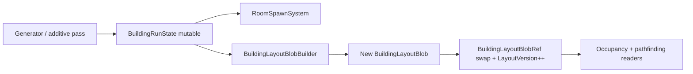
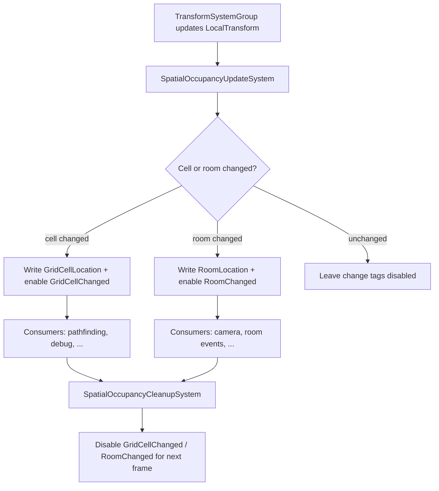

# Spatial occupancy plan — grid cell and room tracking

Follow-up work after **level generator beta** (LevelGen Phases 1–4 in [LevelGenPlan.md](LevelGenPlan.md)). Runtime ECS tracks **which grid cell** and **which room** each opted-in entity occupies, derived from `LocalTransform` and building layout data. When either value changes, consumers are notified via **`IEnableableComponent` change tags**.

Related: [GameDesign.md](GameDesign.md) (persistent run world), [LevelGenPlan.md](LevelGenPlan.md) (grid model, `OccupiedCell`, room instances).

---

## Goals

- Track **grid cell** (`FloorId` + `int2`) for most character entities, spawners, and other gameplay entities that benefit from spatial queries.
- Track **room instance** (`RoomInstanceId`) for the same entities by resolving cell → `OccupiedCell` on the run building layout.
- Store current values **on the entity** so systems can read occupancy without recomputing from transforms every frame.
- **Signal changes** when an entity crosses a cell boundary or enters/leaves a room, using the same enableable-tag pattern for both dimensions.
- Primary use cases (v1):
  1. **Pathfinding** — cheap start/goal cells, walkability lookups, room-graph navigation.
  2. **Camera** — when the **player** changes rooms, snap or blend the camera toward that room’s anchor instead of only nearest global anchor.
- Design for **future consumers** (AI senses, spawn rules, room-scoped events, radar overlays) without baking those into the core tracker.

---

## Prerequisites (level gen beta complete)

This plan assumes the following from [LevelGenPlan.md](LevelGenPlan.md) are shipped before implementation:

| Prerequisite | Why |
|--------------|-----|
| `BuildingRunState` (mutable) bridged into ECS | Authoritative growing layout: `RoomInstance` list + per-floor occupancy |
| `BuildingLayoutBlob` read snapshot on a singleton | Burst-friendly `TryGetCell(floor, cell) → OccupiedCell`; **rebuilt** when run state changes |
| `RoomSpawnSystem` + room prefabs with `CameraAnchorSlot` | Camera-on-room-change needs per-room anchors |
| `CellSize` / `FloorY` from `BuildingGenConfig` on a singleton | World ↔ cell math must match generation |
| `LocalTransform` on tracked entities after spawn | Position source for occupancy |

The pure `THPerfection.LevelGen` library stays testable without Entities; add a thin **`THPerfection.LevelGen.Ecs`** (or `Assets/scripts/Spatial/`) assembly that references both LevelGen and Entities.

---

## Coordinate model (aligned with level gen)

Reuse level-gen conventions — do not invent a second grid:

| Concept | Rule |
|---------|------|
| Gameplay plane | XZ (`TopDownPlane.FromPosition`) |
| Cell | `int2` where `cell.x → world X`, `cell.y → world Z` |
| Cell size | From run config (default `4.0` m, `BuildingGenConfig.CellSize`) |
| World from cell center | `TopDownPlane.ToPosition((float2)cell * cellSize, floorY)` |
| Cell from world position | `int2(math.floor(pos.x / cellSize), math.floor(pos.z / cellSize))` |
| Floor | `FloorId` — beta uses **Main only**; resolve floor from Y or an explicit `FloorMembership` component when multi-floor ships |
| Room | `OccupiedCell.RoomInstanceId` from layout blob at `(floor, cell)`; `0` = outside building / unmapped |

**Cell boundary:** use **floor** division on world XZ (entity is in the cell that contains its transform position). Document whether designers should use entity pivot at feet vs center; default to **transform position** and adjust with an optional `SpatialOccupancyOffset` later if needed.

---

## Run layout: mutable state vs read snapshot

The run building **grows** across rounds and additive generation passes ([GameDesign.md](GameDesign.md) — no map wipes). Unity blob assets are **immutable after creation**, so the layout must not be stored only in a blob.

Use a **two-layer model**:

| Layer | Role | Mutability |
|-------|------|------------|
| **`BuildingRunState`** | Source of truth: `RoomInstance[]`, `BuildingOccupancy` / `FloorGrid`, doorway frontier | **Mutable** — generator stamps new rooms each pass |
| **`BuildingLayoutBlob`** | Read-only snapshot for Burst jobs and occupancy lookup | **Immutable** — **recreated in full** whenever run state commits a layout change |

**When the blob is recreated** (not patched in place):

- Initial run / first generation pass completes
- Each **additive** generation pass (new round budget, event wing, promoted `Open` doors)
- Any system that mutates occupancy and commits new `RoomInstance` data

**Rebuild pipeline** (single commit point, e.g. `BuildingLayoutCommitSystem`):

1. Generator (or reload from persisted instances) writes into **`BuildingRunState`**.
2. `RoomSpawnSystem` instantiates new room entities for added instances.
3. **`BuildingLayoutBlobBuilder`** allocates a **new** blob from current run state, copies all stamped cells + door masks.
4. Singleton swaps `BuildingLayoutBlobRef.Layout` → new reference; **`LayoutVersion`** increments.
5. **Dispose** the previous `BlobAssetReference` (no leak across many rounds).
6. Optional: broadcast `layoutChangedEvent` or set a one-frame tag so pathfinding / spatial systems invalidate caches.

Readers (`SpatialOccupancyUpdateSystem`, pathfinding jobs) use only the **current** blob reference + version. They never write to the blob.



---

## High-level flow



---

## ECS components

### Opt-in tracking

| Component | Type | Purpose |
|-----------|------|---------|
| `TracksSpatialOccupancy` | `IComponentData` (tag) | Entity participates in occupancy updates (characters, enemies, spawners, projectiles if needed) |

Bake this on character prefabs, spawner anchors, and any entity that needs cell/room awareness. Omit on static room geometry (room is implicit from spawn payload).

### Stored state (always present when opted in)

```csharp
public struct GridCellLocation : IComponentData
{
    public FloorId Floor;
    public int2 Cell;
}

public struct RoomLocation : IComponentData
{
    /// <summary>0 = not inside any stamped room cell.</summary>
    public int RoomInstanceId;
}
```

Initialize at spawn from placement payload or first update from transform. Values are **authoritative cached state**, not recomputed by consumers.

### Change signals (`IEnableableComponent`)

```csharp
public struct GridCellChanged : IComponentData, IEnableableComponent
{
    public FloorId PreviousFloor;
    public int2 PreviousCell;
    public FloorId CurrentFloor;
    public int2 CurrentCell;
}

public struct RoomChanged : IComponentData, IEnableableComponent
{
    public int PreviousRoomInstanceId;
    public int CurrentRoomInstanceId;
}
```

**Pattern (new to this project; follow consistently):**

1. Change tags are **added disabled** at bake/spawn (`AddComponent<GridCellChanged>()` then `SetComponentEnabled<GridCellChanged>(false)`).
2. `SpatialOccupancyUpdateSystem` compares cached `GridCellLocation` / `RoomLocation` to newly computed values.
3. On change: update stored location, fill previous/current on the change struct, **`SetComponentEnabled<GridCellChanged>(true)`** (same for room).
4. Consumer systems query with default enabled filter, e.g. `SystemAPI.Query<RefRO<GridCellChanged>>().WithAll<TracksSpatialOccupancy>()` — only entities that changed **this frame**.
5. `SpatialOccupancyCleanupSystem` runs **after** all consumers (`UpdateAfter` camera/path systems, or `OrderLast` in simulation group): disable change tags for the next frame.

This avoids the project’s frame-event allocator for high-frequency spatial churn while still giving a clear “react this frame” hook. Optional **ECS frame events** (see below) can mirror player room changes for UI/logging.

### Run layout singleton

```csharp
public struct BuildingSpatialConfig : IComponentData
{
    public float CellSize;
    public float MainFloorY;   // beta; extend with per-floor Y table later
}

/// <summary>Authoritative mutable run layout. Generator writes here; blob is derived.</summary>
public struct BuildingRunState : IComponentData
{
    // Managed or native-backed: RoomInstance list, BuildingOccupancy, frontier.
    // Not Burst-readable directly — use BuildingLayoutBlob for parallel lookup.
}

public struct BuildingLayoutBlobRef : IComponentData
{
    public BlobAssetReference<BuildingLayoutBlob> Layout;
    public uint LayoutVersion;   // incremented on every full blob recreate
}
```

`BuildingLayoutBlob` (immutable snapshot, **full rebuild** on each layout commit):

- Flat or hash-backed cell map per floor: `(floor, int2) → OccupiedCell` (room id + `DoorMask`).
- Optional: `RoomInstanceId → int2 origin` for room-center queries.
- Optional: `RoomInstanceId → Entity` map maintained at spawn for anchor lookup (separate from blob; updated when rooms spawn).

`BuildingLayoutBlobBuilder.Build(in BuildingRunState)` copies the **entire** current occupancy into a new blob. Cost is acceptable: additive passes are infrequent relative to per-frame simulation, and cell count stays bounded by room budget.

---

## Systems

### `SpatialOccupancyUpdateSystem`

| Property | Value |
|----------|--------|
| Group | `SimulationSystemGroup`, **after** `TransformSystemGroup` |
| Query | `TracksSpatialOccupancy` + `LocalTransform` + `GridCellLocation` + `RoomLocation` + change structs |
| Reads | `BuildingSpatialConfig`, `BuildingLayoutBlobRef` |
| Burst | Yes (`IJobEntity` or `ISystem` + Burst) |

**Per entity:**

1. `float2 xz = TopDownPlane.FromPosition(transform.Position)`.
2. `int2 cell = WorldToCell(xz, config.CellSize)`.
3. `FloorId floor = ResolveFloor(transform.Position, config)` — beta: always `Main`.
4. `layout.TryGet(floor, cell, out var occupied)` → `roomId = occupied.RoomInstanceId` or `0`.
5. If `cell` or `floor` ≠ `GridCellLocation`: update `GridCellLocation`, populate `GridCellChanged`, enable `GridCellChanged`.
6. If `roomId` ≠ `RoomLocation.RoomInstanceId`: update `RoomLocation`, populate `RoomChanged`, enable `RoomChanged`.

**Order note:** run after physics/movement so gameplay position is current. If animation root motion matters, place after `RukhankaAnimationSystemGroup` (same constraint as `CameraAnchorFollowSystem`).

### `SpatialOccupancyCleanupSystem`

- `SimulationSystemGroup`, ordered **last** (or explicitly after camera/path consumers).
- For all entities with enabled `GridCellChanged` / `RoomChanged`, set enabled **false**.

### `SpatialOccupancyInitSystem` (one-shot or on spawn)

- When entities spawn without initialized locations, compute once and set disabled change tags.
- Alternatively, `RoomBootstrapSystem` / character spawn ECB sets initial `GridCellLocation` and `RoomLocation` from spawn pose to avoid a one-frame false “change”.

---

## Consumer systems (v1)

### Pathfinding

Not implemented today (`MoveToSystem` steers directly). This tracker **does not** implement pathfinding; it **feeds** it:

| Layer | Data from occupancy |
|-------|---------------------|
| Cell graph | `BuildingLayoutBlob` cells + `DoorMask` for walkable edges between adjacent cells |
| Entity pose | `GridCellLocation` as A* start/goal without re-deriving from float position |
| Room graph | `RoomInstanceId` adjacency via connected doors (from `RoomInstance` door states) for coarse routing |
| Dynamic blockers | Future: entities with `GridCellLocation` in a spatial hash per cell |

Suggested follow-on doc/system: `PathfindingPlan.md` — cell BFS/A* on main floor, door-aware neighbors via `GridTransforms.Direction()` + `DoorMask`.

Invalidate or requeue paths when `GridCellChanged` fires on the pathing agent, or when `BuildingLayoutBlobRef.LayoutVersion` changes (layout commit / additive gen).

### Camera on player room change

Today `CameraAnchorFollowSystem` picks the **nearest** `CameraAnchor` in world space over a huge default grid.

**Target behavior:**

1. Add consumer `PlayerRoomCameraSystem` (or extend follow system):
   - Query player + enabled `RoomChanged`.
   - Resolve room entity or `CameraAnchor` child baked from that room’s `CameraAnchorSlot`.
   - Set a **preferred anchor** (component on player or camera singleton) for `CameraAnchorFollowSystem` to lerp toward.
2. Fallback: if room has no anchor, keep nearest-anchor behavior.
3. Optional: only react when `RoomChanged.CurrentRoomInstanceId != 0` to avoid jitter at building edge.

Register `roomChangedEvent` in ECS Event System **only if** UI/audio need it; gameplay can use `RoomChanged` enableable query directly.

---

## Optional ECS frame events

For cross-cutting subscribers (UI, analytics, audio), add generated events mirroring the enableable payloads:

| Event | Fields | When |
|-------|--------|------|
| `gridCellChangedEvent` | `Entity Sender`, `FloorId`, `PreviousCell`, `CurrentCell` | Player or any entity — filter in consumer |
| `roomChangedEvent` | `Entity Sender`, `PreviousRoomId`, `CurrentRoomId` | Especially player room transitions |

Emit from `SpatialOccupancyUpdateSystem` via ECB only when the corresponding enableable tag is enabled, if frame events are preferred for those listeners. **Do not** duplicate logic — enableable tags remain the primary ECS signal; events are optional sugar.

---

## Multi-floor (post-beta)

When basement/attic ship:

- Extend `ResolveFloor` using per-floor Y bands from config or `FloorMembership` on entities (stairs, elevators).
- Occupancy lookup unchanged — still per `FloorId` + `int2`.
- Room changes across floors at the same `(x, z)` are valid (vertical links).
- Camera anchors remain per room instance on each floor.

---

## Suggested implementation phases

| Phase | Scope | Deliverable |
|-------|--------|-------------|
| **A** | Layout bridge | `BuildingRunState`, `BuildingLayoutBlobBuilder`, commit system (recreate blob + version bump), `BuildingSpatialConfig` |
| **B** | Core tracker | Components, `SpatialOccupancyUpdateSystem`, cleanup, unit tests for `WorldToCell` / blob lookup / rebuild |
| **C** | Authoring | `TracksSpatialOccupancy` on character + spawner prefabs; spawn init |
| **D** | Camera | `PlayerRoomCameraSystem` + room `CameraAnchor` resolution |
| **E** | Pathfinding prep | Walkability builder from blob; document API for future A* / room graph |
| **F** | Polish | Debug gizmos (cell under entity), optional frame events, spatial hash for dynamic blockers |

Phase **A–C** are the minimum useful slice. **D** and **E** match the stated use cases and can parallelize after **C**.

---

## Proposed file layout

```
Assets/scripts/Spatial/
  GridCellLocation.cs
  RoomLocation.cs
  GridCellChanged.cs
  RoomChanged.cs
  TracksSpatialOccupancy.cs
  BuildingSpatialConfig.cs
  BuildingRunState.cs               # mutable authoritative layout
  BuildingLayoutBlob.cs
  BuildingLayoutBlobBuilder.cs      # full snapshot from BuildingRunState
  BuildingLayoutCommitSystem.cs     # recreate blob on layout change, dispose old ref
  SpatialOccupancyUpdateSystem.cs
  SpatialOccupancyCleanupSystem.cs
  SpatialWorldGrid.cs               # WorldToCell, ResolveFloor static helpers
  PlayerRoomCameraSystem.cs         # phase D
Assets/scripts/Spatial/Tests/
  SpatialWorldGridTests.cs
  BuildingLayoutBlobTests.cs
```

---

## Testing

| Test | Assert |
|------|--------|
| `WorldToCell` | Known world positions → expected `int2` at `CellSize` 4 |
| Layout blob build | Stamped room cells return correct `RoomInstanceId` |
| Layout blob rebuild | After additive pass, new blob includes old + new cells; version increments; old blob disposed |
| Cell boundary | Position at `cell * size + epsilon` stays in cell until crossing |
| Change tags | After simulated move across boundary, `GridCellChanged` enabled one frame then cleaned up |
| Room transition | Move across door between rooms enables `RoomChanged` with correct ids |
| Beta floor | All entities on main floor resolve `FloorId.Main` |

Playmode: debug draw current cell under player; log on `RoomChanged`.

---

## Anti-patterns

- **Second grid math** — do not duplicate cell size or axis mapping outside `BuildingSpatialConfig` + `SpatialWorldGrid`.
- **Poll transform every frame in pathfinding** — read `GridCellLocation` instead.
- **Frame events only** — enabling/disabling every entity every frame via event entities will allocate heavily; use `IEnableableComponent` for the hot path.
- **Recompute room from float position in camera system** — read `RoomLocation` / `RoomChanged`.
- **Track everything** — use `TracksSpatialOccupancy` opt-in; static room meshes do not need per-frame updates.
- **Forget cleanup** — consumers will fire every frame if change tags stay enabled.
- **Mutate the layout blob** — blobs are immutable; update `BuildingRunState`, then recreate the snapshot.
- **Patch blob cells in place** — always full rebuild on commit; patch-in-place is not supported by `BlobAssetReference`.

---

## Edge cases

| Topic | Decision |
|-------|----------|
| Entity outside building | `RoomInstanceId = 0`; room change fires when entering/leaving stamped cells |
| Same room, different cell | `GridCellChanged` yes; `RoomChanged` no |
| Teleport | Large jump updates both; both tags may enable same frame |
| Additive level gen | Commit updates `BuildingRunState` → **recreate** `BuildingLayoutBlob` → `LayoutVersion++`; invalidate path caches; optionally force spatial re-resolve on tracked entities |
| Sub-cell movement | No cell signal until boundary crossed — correct for grid pathfinding |
| Multiple entities per cell | Allowed; no exclusivity constraint on occupancy |
